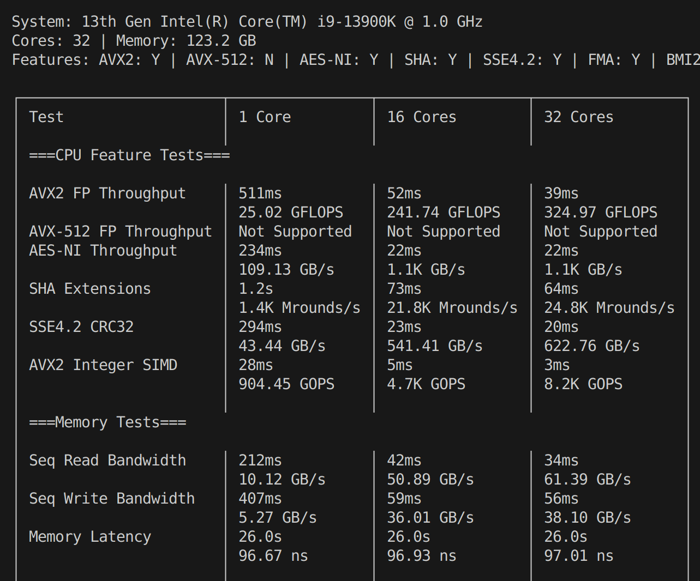

# CoreCrunch

A comprehensive CPU benchmark tool written in Rust that tests low-level CPU intrinsics, memory subsystem performance, and real-world computational workloads. Runs tests across multiple core counts to measure parallel scaling efficiency, and produces a **CoreCrunch Score** for easy comparison between machines.

Cross-platform: Linux (with CPU temperature monitoring) and Windows. Zero compiler warnings.



## Scores

CoreCrunch produces four scores at the end of each run:

| Score | What it measures |
|-------|-----------------|
| **CPU Single-Core** | CPU performance using 1 core (intrinsics + real-world tests) |
| **CPU Multi-Core** | CPU performance at max core count |
| **Memory** | Memory bandwidth and latency |
| **Overall** | Overall system score (geometric mean of all three) |

A mid-range modern CPU scores ~1000. Higher is better.

## Tests

### CPU Feature Tests (Low-Level Intrinsics)
* AVX2 FP Throughput — FMA-based floating point
* AVX-512 FP Throughput — 512-bit SIMD (shows "Not Supported" if unavailable)
* AES-NI Throughput — hardware AES encryption rounds
* SHA Extensions — hardware SHA-256 rounds
* SSE4.2 CRC32 — hardware CRC32C
* AVX2 Integer SIMD — 256-bit integer multiply/add

### Memory Tests
* Sequential Read Bandwidth
* Sequential Write Bandwidth
* Memory Latency (pointer-chase)

### Real World Tests
* LLM Inference Simulation — matrix multiply + ReLU layers
* Gzip Compress/Decompress
* Image Blur (5x5 Gaussian kernel)
* Large Dataset Sort

### Legacy Tests (v1 benchmarks, via `--legacy`)
* FFT (pure-Rust Cooley-Tukey)
* SHA-256 (software)
* Matrix Multiplication
* Floating Point Ops
* Monte Carlo Pi
* Prime Sieve
* N-Body Simulation

## Installation

Download the latest release from the [Releases](https://github.com/ddxfish/corecrunch/releases) page (Linux and Windows binaries available).

Or build from source:
```bash
git clone https://github.com/ddxfish/corecrunch
cd corecrunch
cargo build --release
```

Cross-compile for Windows from Linux:
```bash
rustup target add x86_64-pc-windows-gnu
sudo apt install mingw-w64
cargo build --release --target x86_64-pc-windows-gnu
```

## Usage

```
Usage: corecrunch [OPTIONS]

Options:
  -p, --processes <PROCESSES>  Number of processes (default: CPU core count)
  -i, --intensity <INTENSITY>  Intensity level 1-10 (default: 3)
      --low-level-only         Run only CPU feature tests
      --memory-only            Run only memory tests
      --real-world-only        Run only real-world tests
      --legacy                 Include legacy v1 benchmarks
      --legacy-only            Run only legacy v1 benchmarks
      --no-temp                Disable CPU temperature monitoring
  -h, --help                   Print help
  -V, --version                Print version
```

### Examples

```bash
# Default full run (~2 minutes)
corecrunch

# Quick test run
corecrunch -i 1

# CPU-only tests with legacy benchmarks
corecrunch --low-level-only --legacy

# Compare legacy v1 results across machines
corecrunch --legacy-only

# Heavy stress test
corecrunch -i 7
```

## CPU Temperature

CPU temperature is monitored by default on Linux (before/after each core-count run). It reads from hwmon sensors and supports Intel coretemp, AMD k10temp/zenpower, and similar drivers. If no sensors are found, the row is silently omitted. Use `--no-temp` to disable.

Temperature monitoring is not available on Windows builds.

## License

This project is licensed under the MIT License - see the [LICENSE](LICENSE) file for details.
